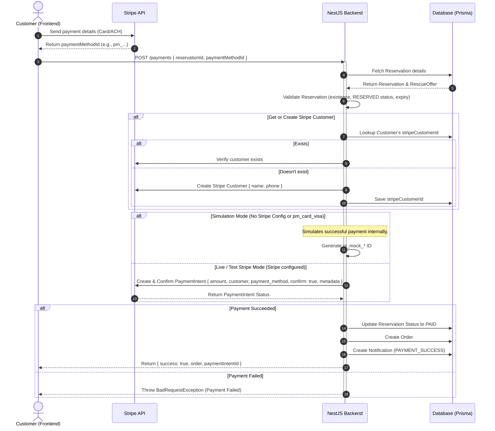

# Stripe Payment Integration Documentation

This document describes how the Stripe payment flow is implemented, configured, and tested in the Restock backend application.

---

## 📌 Architecture Overview

The payment system is built on **NestJS** and integrates with **Stripe** to process payments and manage payment methods.

Features implemented:
1. **Dynamic Customer Provisioning:** Stripe customers are automatically provisioned and mapped to our database customers via `stripeCustomerId`.
2. **Payment Method Management:** APIs to attach, detach, and list customer-saved payment methods (cards).
3. **Robust Checkout Flow:** Uses `PaymentIntents` confirming immediately with stored cards.
4. **Webhook Processing:** Secure webhook handler to asynchronously confirm orders when Stripe payment is authorized.

---

## 🔄 System Flow Diagram

The sequence diagram below details the end-to-end payment flow:



---

## 🛠️ API Reference

### 1. Process Payment
Processes payment for a specific reservation.

- **URL:** `/payments`
- **Method:** `POST`
- **Body Schema (`ProcessPaymentDto`):**
  * `reservationId` (string, MongoId, Required): The reservation ID.
  * `paymentMethodId` (string, Required): Stripe `PaymentMethod` ID (e.g., `pm_...` or test tokens).

### 2. Attach Payment Method
Attaches a Stripe payment method to a database customer.

- **URL:** `/payments/methods/attach`
- **Method:** `POST`
- **Body Schema (`AttachPaymentMethodDto`):**
  * `customerId` (string, MongoId, Required): The customer ID.
  * `paymentMethodId` (string, Required): The Stripe `PaymentMethod` ID.

### 3. Detach Payment Method
Detaches a payment method.

- **URL:** `/payments/methods/:id/detach`
- **Method:** `POST`
- **Parameters:**
  * `id` (string, Required): The Stripe `PaymentMethod` ID.

### 4. List Customer Payment Methods
Lists all cards saved for a customer.

- **URL:** `/payments/methods/customer/:customerId`
- **Method:** `GET`
- **Parameters:**
  * `customerId` (string, MongoId, Required): The customer ID.

### 5. Stripe Webhook Listener
Receives events from Stripe securely.

- **URL:** `/payments/webhook`
- **Method:** `POST`
- **Headers:** `stripe-signature`

---

## ⚠️ Configuration & Environment Setup

### Environment Variables
Ensure you have the following variables in your `backend/.env` file:

```env
# Stripe Configuration
STRIPE_PUBLISHABLE_KEY=pk_test_...
STRIPE_SECRET_KEY=sk_test_...
STRIPE_WEBHOOK_SECRET=whsec_...
```

> [!IMPORTANT]
> **Stripe Webhook Signature Verification Requirement:**
> To securely verify webhook signatures, NestJS needs access to the raw request body. Update your `main.ts` entry file to pass `{ rawBody: true }`:
> ```typescript
> const app = await NestFactory.create(AppModule, { rawBody: true });
> ```

---

## 🧪 Testing & Simulating Payments

1. **Card Simulation:** Send `"paymentMethodId": "pm_card_visa"` to `/payments` to simulate success.
2. **Stripe Test Mode:** Set valid sandbox keys in `.env` and use Stripe test card methods (e.g., `pm_card_visa`) to confirm payments against the actual Stripe test environment.
